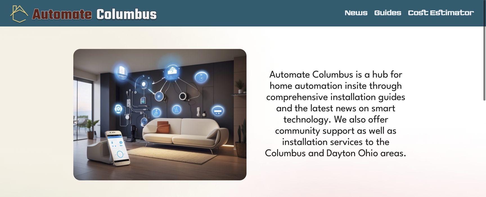
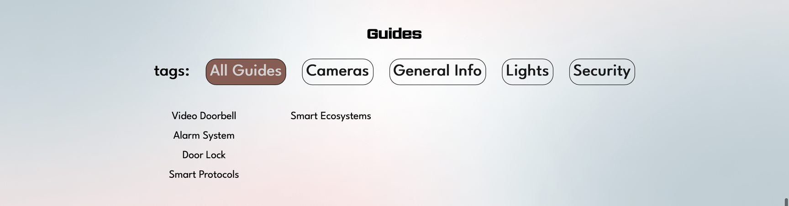
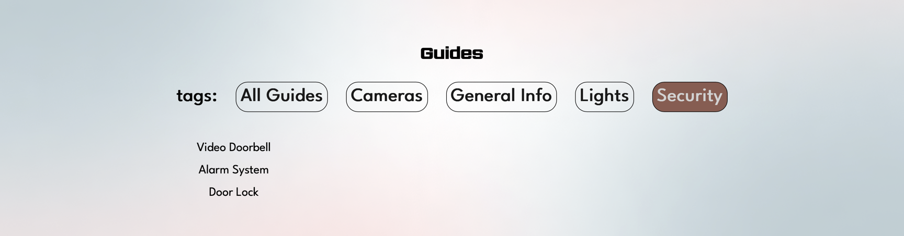
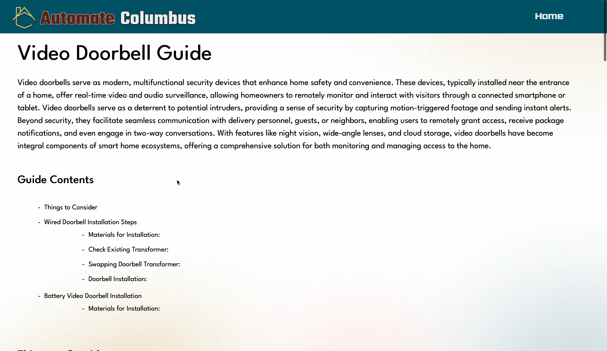
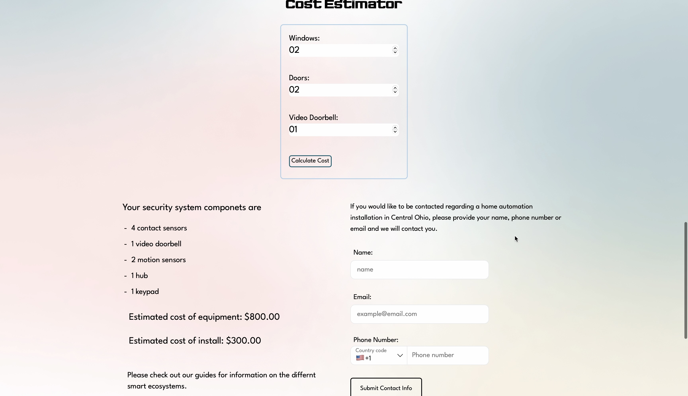

# Automate Columbus

Welcome to the Automate Columbus! A hub containing the latest news, comprehensive guides, and a cost estimator. Designed to be a tool for anyone looking on information related to home automation. Transform your living space into an intelligient experience.

#### [Check out the demo here](https://automatecolumbus-my.sharepoint.com/:v:/g/personal/mattkarp_automatecolumbus_onmicrosoft_com/EWkB5wL-SkZApCnU2M5byzgByAI0YlMB2d3w58kkJPe_lw?nav=eyJyZWZlcnJhbEluZm8iOnsicmVmZXJyYWxBcHAiOiJPbmVEcml2ZUZvckJ1c2luZXNzIiwicmVmZXJyYWxBcHBQbGF0Zm9ybSI6IldlYiIsInJlZmVycmFsTW9kZSI6InZpZXciLCJyZWZlcnJhbFZpZXciOiJNeUZpbGVzTGlua0NvcHkifX0&e=KYDCaq)

## Table of Contents

- [Development](#features)
- [News](#news)
- [Guides](#guides)
- [Cost Estimator](#cost-estimator)

## Development

This full-stack web app utilizes Figma for prototyping. Node.js and Vue.js for client side development and CSS and Tailwind for styling and creating a responsive design. RSS feeds provide real-time news updates. Guides are rendering markdown formated text in Markdown. The backend relies on a C#/.NET Core API, managing data stored in a SQL Server database hosted on Azure Cloud Services.

## News

Stay up-to-date with the latest news in smart home automation. The articles cover product launches, industry insights, and tips to enhance your smart living experience.

- RSS feeds from 3 sites provide the articles

## Guides

Unlock the full potential of your smart home devices with our detailed guides. Whether you're a beginner or an expert, find the information you need to make the most of your automation setup.

- Guides render markdown in order to use a commonly known format, creating the oppurtunity for additional contributers.

### Guide View based on selection

## Cost Estimator

Plan your smart home budget with our intuitive cost estimator. Customize your setup and get an instant cost breakdown.

- Cost are calculated using sql triggers.
- Equimpment and Contact info are saved to database, tied together with an input ID.

